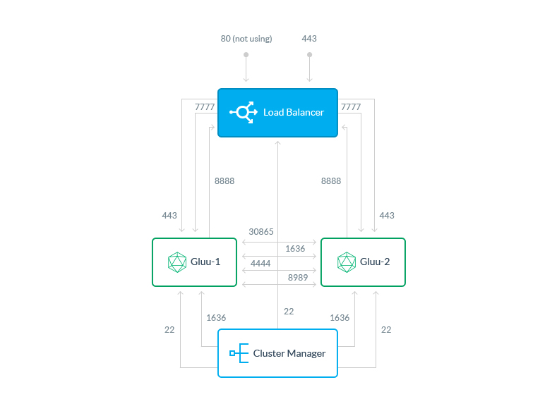

# Cluster Manager Installation

## Prerequisites

- A minimum of four (4) machines:
    - Cluster Manager: One (1) machine running **Ubuntu 14 or 16** with at least 1GB of RAM for cluster manager, which will proxy TCP and HTTP traffic.
    - Load Balancer: One (1) machine running Ubuntu, CentOS, RHEL, or Debian with at least 1GB of RAM for the Nginx load balancer and Twemproxy. This server is not necessary if you are using your own load-balancer **and** you use redis-cluster on the Gluu server installations.
    - Gluu Server(s): At least two (2) machines running Ubuntu, CentOS, RHEL, or Debian for Gluu Servers.

## Ports

The following external ports need to be opened on the following machines if you're using a default Cluster Manager configuration:



| Gluu Servers | Description |
| -- | -- |
| 22 | SSH |
| 443 | SSL |
| 30865 | Csync2 |
| 1636 | LDAP |
| 4444 | LDAP Repl |
| 8989 | LDAP Repl |
| 7777 | Stunnel |

| Load Balancer | Description |
|--| --|
| 22 | SSH |
| 80 | HTTP |
| 443 | HTTPS |
| 8888 | Stunnel |

!!! Note
    The Load Balancer is the only node that should be externally accessible through 80 and 443 from outside your cluster network.

| Cluster Manager | Description|
| -- | --|
| 22 | SSH |
|1636| LDAP |

### Port Usage

- 22 will be used by Cluster Manager to pull logs and make adjustments to the systems

- 80 and 443 are self explanatory. 443 must be open between the Load Balancer and the Gluu Server

- 1636, 4444 and 8989 are necessary for LDAP usage and replication. These should be open between Gluu Server nodes

- 30865 is the default port for csync2 file system replication

- 7777 and 8888 are for securing the distributed caching communication the Gluu servers with Stunnel

### Proxy

If you're behind a proxy you'll have to configure it inside the container/chroot as well.

Log in to each gluu node and set http proxy in container/chroot to your proxy's url like so:

```

# /sbin/gluu-server-3.1.3 login

Gluu.root# vi /etc/yum.conf

```

insert into section [main]:

```

[main]
.
.
proxy=http://proxy.example.org:3128/

```

Save the file.

The following error will be shown in Cluster Manager if the proxy is not configured properly inside the chroot:

```
One of the configured repositories failed (Unknown), and yum doesn't have enough cached data to continue... etc.

Could not retrieve mirrorlist http://mirrorlist.centos.org/?release=7&arch=x86_64&repo=updates&infra=stock error was 14: curl#7 - "Failed to connect to 2604:1580:fe02:2::10: Network is unreachable"
```

## Installing Cluster Manager

### SSH & Keypairs

Give Cluster Manager the ability to establish an ssh connection to the servers in the cluster. This includes the NGINX/load-balancing server. A simple keygeneration example:

`ssh-keygen -t rsa -b 4096`

- This will initiate a prompt to create a keypair. Cluster Manager must be able to open connections to the servers.

!!! Note
    Cluster Manager now works with encrypted keys and will prompt you for the password any time Cluster Manager is restarted.

- Copy the public key (default is `id_rsa.pub`) to the `/root/.ssh/authorized_keys` file of all servers in the cluster, including the NGINX server (unless another load-balancing service will be used). **This MUST be the root authorized_keys.**

### Install Dependencies

Install the necessary dependencies on the Gluu Cluster Manager machine:

```
sudo apt-get update
sudo apt-get install python-pip python-dev libffi-dev libssl-dev python-ldap redis-server default-jre
sudo pip install --upgrade setuptools influxdb psutil
```

Default-jre is for license requirements. It is not necessary if Java is already installed.

### Install the Package

Install cluster manager using the following command:

```
pip install clustermgr
```

There may be a few innocuous warnings, but this is normal.

### Add License Validator

Prepare the license validator by using the following commands:

```
mkdir -p $HOME/.clustermgr/javalibs
wget -q https://ox.gluu.org/maven/org/xdi/oxlicense-validator/3.1.3.Final/oxlicense-validator-3.1.3.Final-jar-with-dependencies.jar -O $HOME/.clustermgr/javalibs/oxlicense-validator.jar
```

!!! Note
    License files are not currently enforced, it's on the honor system! Please see the [Gluu Support License](https://github.com/GluuFederation/cluster-mgr/blob/master/LICENSE) to see if you're eligible to use Cluster Manager in production. In future versions, a license file may be required.

!!! Warning
    All Cluster Manager commands need to be run as root.

### Add Key Generator

If automated key-rotation is required, you'll need to download the keygen.jar. Prepare the OpenID Connect keys generator by using the following commands:

```
mkdir -p $HOME/.clustermgr/javalibs
wget -q https://ox.gluu.org/maven/org/xdi/oxauth-client/3.1.3.Final/oxauth-client-3.1.3.Final-jar-with-dependencies.jar -O $HOME/.clustermgr/javalibs/keygen.jar
```

Automated key-rotation can be configured inside the Cluster Manager UI.

### Stop/Start/Restart Cluster-Mgr

The following commands will stop/start/restart all the components of Cluster Manager:

 - `clustermgr-cli stop`
 - `clustermgr-cli start`
 - `clustermgr-cli restart`


!!! Note
    All the Cluster Manager logs can be found in the `$HOME/.clustermgr/logs` directory

### Create Credentials

When Cluster Manager is run for the first time, it will prompt for creation of an admin username and password. This creates an authentication config file at `$HOME/.clustermgr/auth.ini`.

### Install oxd (optional)

We recommend using the [oxd client software](../authentication/index.md) to leverage your Gluu Server(s) for authentication to Cluster Manager. After oxd has been installed and configured, default authentication can be disabled by removing the authentication config file [specified above](#create-credentials).

### Create New User

We recommend creating an additional "cluster" user, other than the one used to install and configure Cluster Manager.

This is a basic security precaution, due to the fact that the user SSHing into this server has unfettered access to every server connected to cluster manager. By using a separate user, which will still be able to connect to localhost:5000, an administrator can give an operator limited access to a server, while still being able to take full control of Cluster Manager.

```
ssh -L 5000:localhost:5000 cluster@<server>
```

### Log In

Navigate to the cluster-mgr web GUI on your local machine:

```
http://localhost:5000/
```

## Deploy Clusters
Next, move on to [deploy the Gluu cluster](../deploy/index.md).
