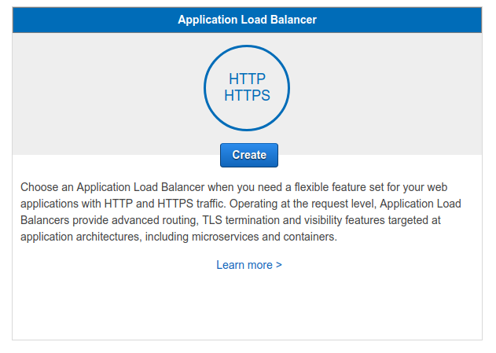
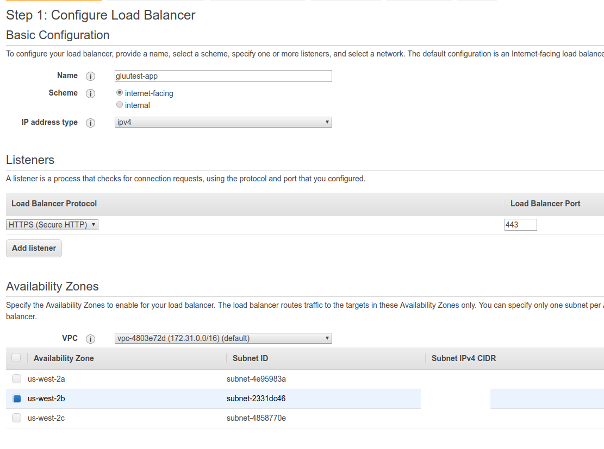
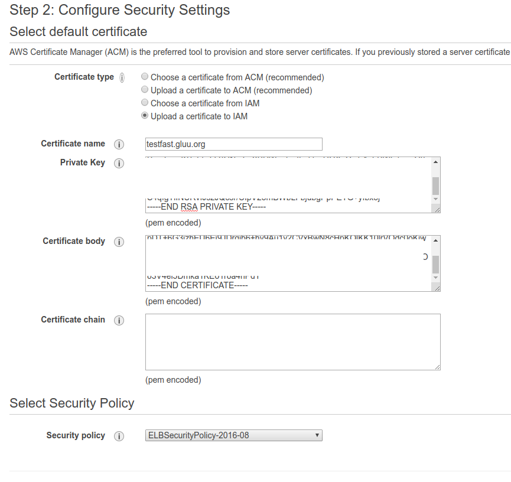
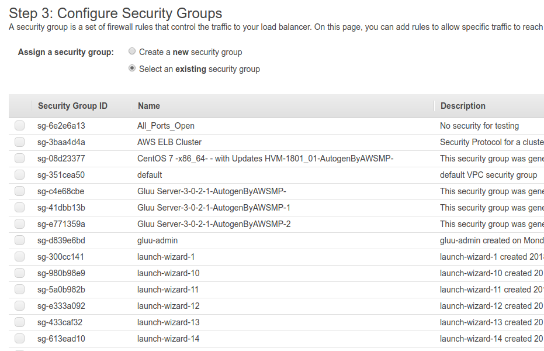
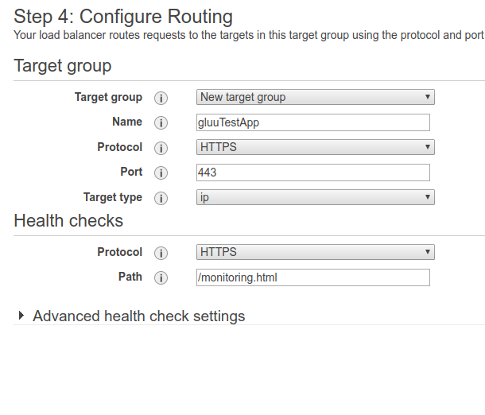
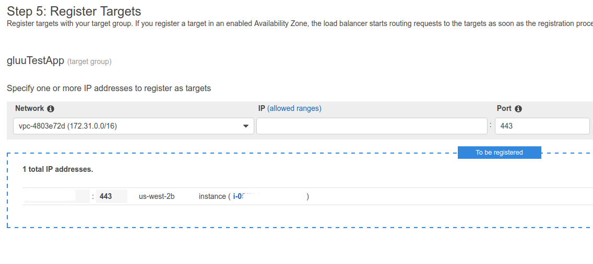
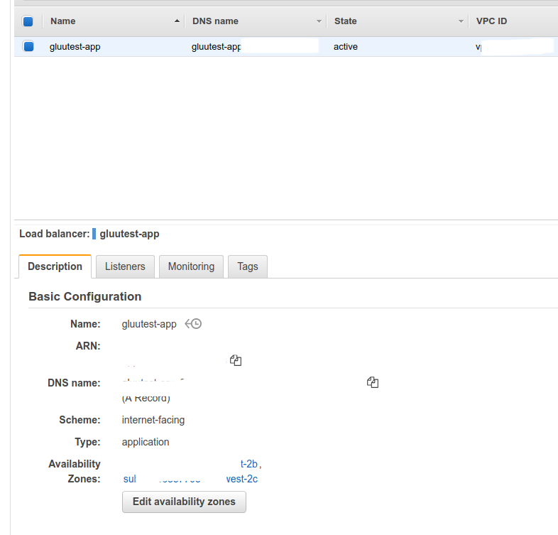

# How to prepare AWS load balancer and add Gluu Servers behind it

## Configure AWS Load balancer

We are going to configure a 'Application Level' Load balancer for this operation. We need to make sure that our Gluu Server has real hostname and real cert installed, otherwise there might be lot of unexpected hiccups. 

 - Log into AWS control panel
 - From 'Load Balancers' tab: 
   - 'Create Load balancer' 
   - Select 'Application Load Balancer'. 
   
   - Step 1: Configure Load balancer
     - Name: Anything you prefer
     - Scheme: Internet Facing
     - IP Address type: ipv4
     - Listeners: HTTPS
     - Availability Zones: Make sure to select zones where your Gluu Server resides
   
   - Step 2: Configure Security Settings
    - Certificate configuration: 
      - Certificate Type: 'Upload a certificate to IAM' 
      - Certificat name: Provide some name
      - Private Key: Paste 'httpd.key' from /etc/certs/ of Gluu Server
      - Certificate body: Paste 'httpd.crt' from /etc/certs/ of Gluu Server
      - Certificate Chain: Add cert chain if you have any
   
    - Add Security Group: 
      - Add security groups where your Gluu Servers are configured.
   
  - Step 4: Configure Routing
    - If you have a Target Group already, you can select that from drop down menu. But if you don't have any then: 
      - Target Group: New target Group
      - Name: Some test name
      - Protocol: HTTPS
      - Port: 443
      - Target Group: ip
      - Health check: HTTPS
      - Path: /monitoring.html [image]. Make sure to create a html file named 'monitoring.html' inside /var/www/html/ of your Gluu Server and restart apache after that. Otherwise AWS load balancer health check will fail and it won't be able to detect our Gluu Servers. 
  
  - Step 5: Register Targets: 
    - Search with IP address of your Gluu Servers and add them here in this list. 
  
  - Step 6: Review: 
    - An overview of configuration which will be used to create this new load balancer. You can double check and reconfigure any component if required. After successful completion, you should see a confirmation from AWS like below.
  

## Testing

 - If you select your load balancer from AWS control panel, you will see a setup like below. Get the IP address of A record and map that in your computer's /etc/hosts file. As for example for our case it would be: `1.2.3.4 testfast.gluu.org`. 'testfast.gluu.org' is the hostname we used for our Gluu Server.
 
