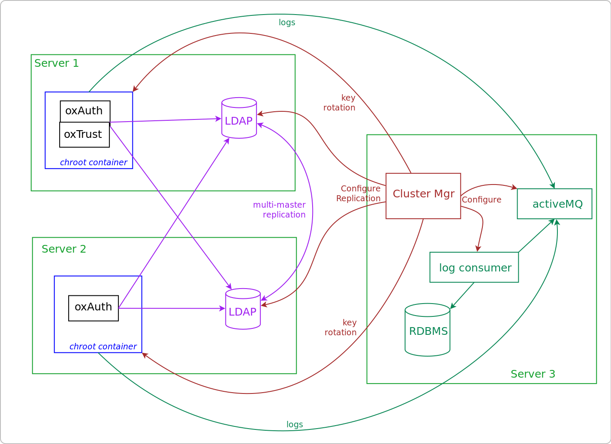

# Preparing Gluu CE for Replication

## Preface

This page is about OpenLDAP replication used as the data storage for Gluu Server. 
OpenLDAP supports many different types of replication 
[topological setups](http://www.openldap.org/doc/admin24/replication.html). 
The Cluster Manager application by Gluu supports two of them.

- **Delta-Synrepl** - for high availability single master (read/write) multiple consumers (read only) setup.
- **Mirror Mode** - for fall back double master (read/write) multiple consumers under each master (read only) setup.
This document outline the setup procedure for both mode of operations.

## Migration Procedure for Mirror Mode



### Pre-requisites

1. Existing Gluu Server 3.0.1 installation. Refer [installation guide](https://gluu.org/docs/ce/latest/installation-guide/install/) for details.
2. A new server to act as mirror.
3. Cluster Manager installed and accessible from web browser.

### Server 1 (Existing Gluu Server)

1. **Backup Data:** Login login to the chroot environment of the Gluu server. 
    While inside the chroot, stop LDAP server and export its data for backup
   

    `# service solserver stop`
    
    `# /opt/symas/bin/slapcat -l alldata.ldif`
    
2. **Edit the file** `/opt/symas/etc/openldap/symas-openldap.conf` 
    to allow servers within chroot to connect to LDAP and make OpenLDAP to use OLC (On-Line Configuration).
    As Gluu recommends to use FQDN or IP for its connections to LDAP.
   
    Change the values of `HOST_LIST` and `EXTRA_SLAPD_ARGS`
    
    `HOST_LIST="ldaps://127.0.0.1:1636/"
    to 
    HOST_LIST="ldaps://127.0.0.1:1636/ ldaps://<server_ip>:1636"`

    `EXTRA_SLAPD_ARGS=" "
    to
    EXTRA_SLAPD_ARGS="-F /opt/symas/etc/openldap/slapd.d"`
   
    
3. **Generate new SSL certificate for OpenLDAP:** The default certificate for OpenLDAP in Gluu Server is for localhost only, we need to generate a hostname based certificate for wider access. (Skip/Modify this step if you are using a different CA system). **Important:** Common Name (e.g. server FQDN or YOUR name) should be your hostname.

    !!!Warning: 
            
            Make sure the "Common Name" in CSR generated next is full **hostname** of the first server, and NOT "localhost"!
    
    
    `# cd /etc/certs`
    
    `# mkdir old_certs`
    
    `# mv openldap.* old_certs/`
    
    `# /usr/bin/openssl genrsa -des3 -out /etc/certs/openldap.key.orig 2048`
    
    `# /usr/bin/openssl rsa -in /etc/certs/openldap.key.orig -out /etc/certs/openldap.key`
    
    `# /usr/bin/openssl req -new -key /etc/certs/openldap.key -out /etc/certs/openldap.csr`
    
    `# /usr/bin/openssl x509 -req -days 365 -in /etc/certs/openldap.csr -signkey /etc/certs/openldap.key -out /etc/certs/openldap.crt`

    *Use this host's hostname instead of `<server1>` in the command below*
    
    `# /opt/jre/bin/keytool -import -trustcacerts -alias <server1>_openldap_2 -file /etc/certs/openldap.crt -keystore /opt/jre/jre/lib/security/cacerts -storepass changeit -noprompt`
    
    `cp openldap.crt openldap.pem`
    
    
4. **Configure oxAuth to both the servers:** 
    Add the hostname (FQDN) of both the servers to `/etc/gluu/conf/ox-ldap.properties` as shown below. 
    This points the oxAuth to the two LDAP servers it can connect to, providing fallback in case 
    of one server failing.
    
    Add the server FQDN to the value `servers`
    
    `servers: <hostname>:1636,<server_2_hostname>:1636`
     
5. **Create a backup of some files necessary for replication:**
    
    
    `# cd ~`
    
    `# mkdir repfiles`
    
    `# cd repfiles`
    
    `# cp /etc/certs/openldap.crt .`
    
    `# cp -r /etc/gluu/conf/ .`
    
    `# cd ..`
    
    `# tar -czf repfiles.tar.gz repfiles`
    
6. Copy the backup files to local computer, we will use this to configure the second server
   
    ```
    scp root@server1:/opt/gluu-server-3.0.1/root/repfiles.tar.gz </location/in/local/server>
    ```

!!!Note:
    
    There is no need to start the LDAP server (service solserver) now, it would be configured and started by the Cluster Manager later.

### Server 2 (Mirror Server)

1. [Install CE package on server 2](https://gluu.org/docs/ce/latest/installation-guide/install/). 
    The aim here is to setup the LDAP and oxAuth only so, when going through components selection set of questions in `setup.py` interactive menus respond with "Yes" only to "Install oxAuth", "LDAP" and "JCE", and with "No" for all other components.

2. **Copy the backfiles from server 1 to server 2:**
    
    ```
    scp repfiles.tar.gz root@server2:/opt/gluu-server-3.0.1/root/
    ```
    
3. **Replace the existing files with backup ones:** This sets up the second gluu-server to act like the twin of the first one
    
    
    `# ssh root@server_2`
    
    `# service gluu-server-3.0.1 login`
    
    `# tar -xvf repfiles.tar.gz`
    
    `# cd repfiles`
    
    `# rm -rf /etc/gluu/conf/`
    
    `# cp -r conf /etc/gluu/`
    
    `# chown -R root:gluu /etc/gluu/conf`
    
    *Use first server's hostname for alias in the command below as we need it to be added to Java's truststore so Gluu's components running on this host could connect to LDAP server on the other one using SSL/TLS*
    
    `# /opt/jre/bin/keytool -import -trustcacerts -alias <server_1_hostname>_openldap_2 -file openldap.crt -keystore /opt/jre/jre/lib/security/cacerts -storepass changeit -noprompt`
    
4. **Replace the OpenLDAP certificates:**

    `# cd /etc/certs`
    
    `# mkdir old_certs`
    
    `# mv openldap.* old_certs/`
    
    `# /usr/bin/openssl genrsa -des3 -out /etc/certs/openldap.key.orig 2048`
    
    `# /usr/bin/openssl rsa -in /etc/certs/openldap.key.orig -out /etc/certs/openldap.key`
    
    !!!Warning: 
            
            Make sure the "Common Name" in CSR generated next is full **hostname** of the second server, and NOT "localhost"!
    
    `# /usr/bin/openssl req -new -key /etc/certs/openldap.key -out /etc/certs/openldap.csr`
    
    `# /usr/bin/openssl x509 -req -days 365 -in /etc/certs/openldap.csr -signkey /etc/certs/openldap.key -out /etc/certs/openldap.crt`

    *Use this host's hostname instead of `<server2>` in the command below*
    
    `# /opt/jre/bin/keytool -import -trustcacerts -alias <server2>_openldap_2 -file /etc/certs/openldap.crt -keystore /opt/jre/jre/lib/security/cacerts -storepass changeit -noprompt`
    
    `# cp openldap.crt openldap.pem`
        
5. **Edit the file** `/opt/symas/etc/openldap/symas-openldap.conf` 
    to allow servers within chroot to connect to LDAP and make OpenLDAP to use OLC (On-Line Configuration).
    As Gluu recommends to use FQDN or IP for its connections to LDAP.
   
    Change the values of `HOST_LIST` and `EXTRA_SLAPD_ARGS`
    
    `HOST_LIST="ldaps://127.0.0.1:1636/"
    to 
    HOST_LIST="ldaps://127.0.0.1:1636/ ldaps://<server_ip>:1636"`

    `EXTRA_SLAPD_ARGS=" "
    to
    EXTRA_SLAPD_ARGS="-F /opt/symas/etc/openldap/slapd.d"`

6. **Clean up the existing LDAP data files:** The data would be replicated from server 1 when configured.
    
    ```
    rm -rf /opt/gluu/data/
    ```

### Mirror Server 1 to Server 2

Copy `openldap.crt` from server 2 to server 1 and import it into the truststore for the apps like oxAuth to connect to the LDAP in server 2.
```bash
scp root@server2:/opt/gluu-server-3.0.1/etc/certs/openldap.crt .
scp openldap.crt root@server1:/opt/gluu-server-3.0.1/root/server2_openldap.crt
ssh root@server1
service gluu-server-3.0.1 login
/opt/jre/bin/keytool -import -trustcacerts -alias <server2>_openldap_2 -file server2_openldap.crt -keystore /opt/jre/jre/lib/security/cacerts -storepass changeit -noprompt
```

Now both the servers are ready to be configured to a cluster. 
After you get the Cluster Manager installed, follow the **Mirror Mode** in [replication setup guide](../replication/Setting-up-LDAP-replication.md)


