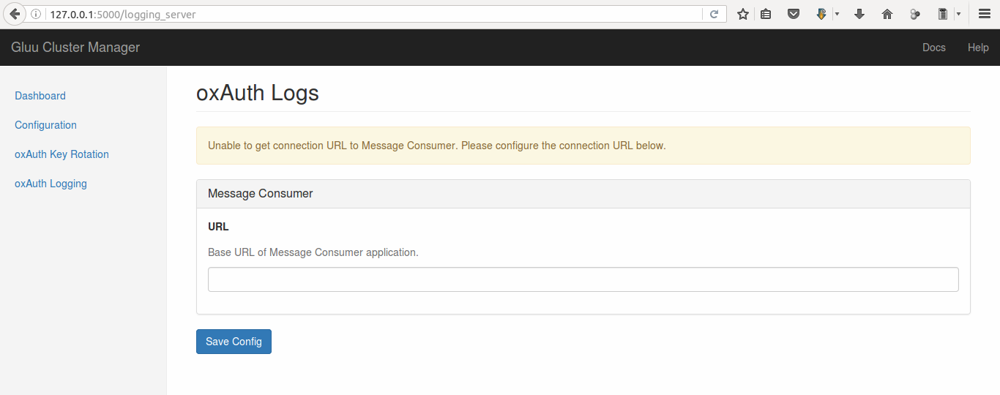
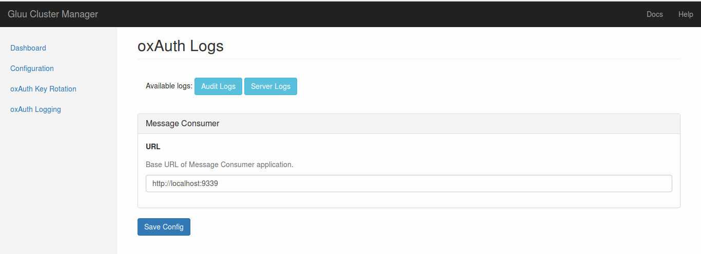
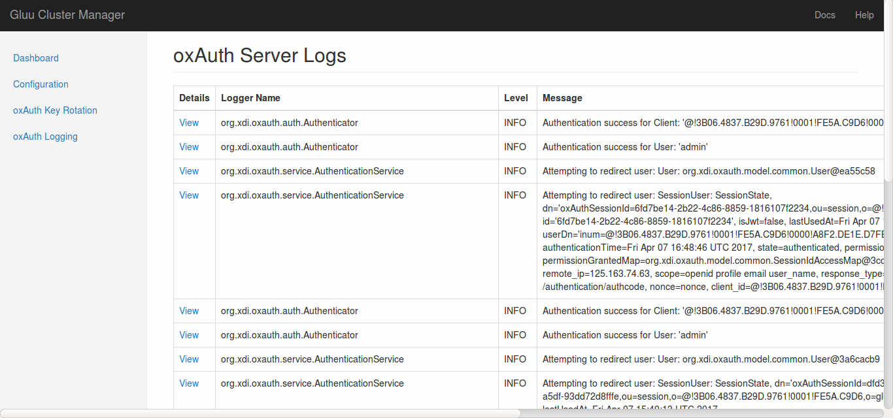

## Configuring Message Consumer

In clustered oxAuth setup, all server logs can be stored into ActiveMQ via [Message Consumer](https://github.com/GluuFederation/message-consumer) application.

To see those logs, we need to connect Cluster Manager to Message Consumer application:

1. Login to server where oxAuth is hosted.

2. Unpack `oxauth.war` into its own directory, for example:

        cd /opt/gluu/jetty/oxauth/webapps
        unzip oxauth.war -d oxauth

3. Move `oxauth.war` to somewhere else to avoid conflict with unpacked oxAuth directory.

4. Modify `/opt/gluu/jetty/oxauth/webapps/oxauth/WEB-INF/classes/log4j2.xml` to re-configure the log by adding new directive inside `<Appenders>` and `Loggers` tags:

        <Appenders>
            <!-- some lines are omitted -->
            <JMS name="jmsQueue"
                destinationBindingName="dynamicQueues/oxauth.server.logging"
                factoryName="org.apache.activemq.jndi.ActiveMQInitialContextFactory"
                factoryBindingName="ConnectionFactory"
                providerURL="tcp://<cluster-mgr-ip>:61616"
                userName="admin"
                password="admin">
            </JMS>
        </Appenders>
        <Loggers>
            <!-- some lines are omitted -->
            <Root level="info">
                <AppenderRef ref="FILE" />
                <AppenderRef ref="STDOUT" />
                <AppenderRef ref="jmsQueue"/>
            </Root>
        </Loggers>

5. Restart oxAuth service:

        service oxauth restart

6. Exit from oxAuth server.

Login to Cluster Manager server, and click __oxAuth Logging__ link in left sidebar menu, a new form will be displayed as shown below:

Note that if the URL is empty or unreachable, a warning message will be displayed at the top of the page.

### Message Consumer URL

The URL specifies full URL of Message Consumer application (REST API).
Message Consumer is installed by default when we install `gluu-cluster-mgr` package.

!!!Note

    Replace localhost with actual Cluster Manager server IP address.

Save the URL by clicking __Save Config__ button.
If URL is reachable, then 2 new links will be displayed, __Audit Logs__ and __Server Logs__.
In this example, we will focus on server logs. Click the __Server Logs__ link.

### oxAuth Server Logs

If oxAuth logs are available in ActiveMQ, Cluster Manager will show them in paginated list.

Each log details can be viewed by clicking __View__ under the Details table header.
An example of server log details is shown below:

### Message Consumer Availability

If somehow Message Consumer is down/unavailable for various reason, oxAuth won't be able to send logs to Message Consumer,
but oxAuth service will keep running.
