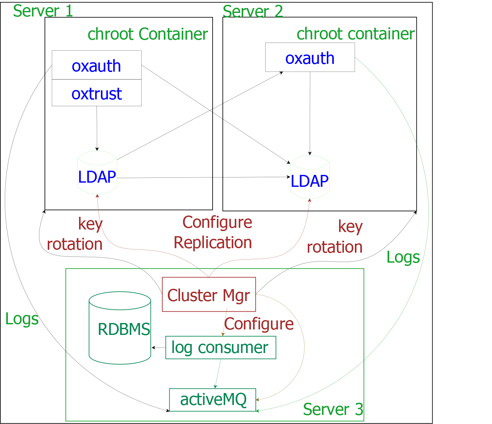

# Gluu Cluster Manager Documentation
## Introduction
Gluu's Cluster Manager software simplifies the process of replicating data across multiple Gluu Servers in order to achieve high availability and failover. 

## Prerequisites
- Gluu Server 3.x

!!! Note
    If you need to cluster Gluu Server 2.x, please review our [csync docs](https://gluu.org/docs/ce/2.4.4/cluster/csync-installation/).

## How to Use Cluster Manager
Follow these steps to use Gluu's Cluster Manager software:

1. Deploy a single instance of the Gluu Server. Follow the [Gluu Server installation instructions](https://gluu.org/docs/ce/latest/installation-guide/install/).

2. Deploy a single instance of Cluster Manager app. Follow the [Cluster Manager installation instructions](https://gluu.org/docs/cm/alpha/installation/Installation/).

3. Deploy one or more mirror instances of Gluu Server. [Read the docs](https://gluu.org/docs/cm/alpha/configuration/configuring-GluuCE-Cluster/#server-2-mirror-server).

4. Use Cluster Manager to replicate the data from one server to another. [Read the docs]( https://gluu.org/docs/cm/alpha/replication/Setting-up-LDAP-replication/).

5. Repeat step 3 and 4 for as many servers as you would like to include in your cluster.

6. Configure oxAuth logs. [Read the docs](https://gluu.org/docs/cm/alpha/configuration/configuring-oxAuth-Logs/).

7. Configure oxAuth key rotation. [Read the docs](https://gluu.org/docs/cm/alpha/configuration/configuring-oxAuth-Key-Rotation/).

## Architecture Diagram of Cluster Manager

