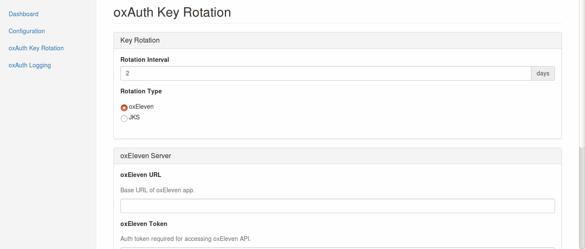

## Configuring oxAuth Key Rotation

Key rotation consists of several processes:

1. Generating private keys (stored in `oxEleven` or `JKS` backend)
2. Generating public keys and save them to LDAP.
3. Running scheduled background job that executes process 1 and 2.

To configure oxAuth key rotation, click __oxAuth Key Rotation__ in left sidebar menu.

### Key Rotation Interval

This value determines the interval (in days) of automatic key rotation after configuration has been saved.
For example, if key rotation config are saved on 21st August, the next key rotation will occur automatically
at 23rd August and so on.

### Key Rotation Type

There are 2 backend types we can choose, `oxEleven` and `JKS` (Java keystore).

#### JKS Backend

When we choose JKS backend, a new section will appear as shown below.
Note, we need to add oxAuth server(s) where JKS file will be distributed to all available servers.
To add oxAuth server, type the hostname or IP address of the server in the text field.
Afterwards, click __Add oxAuth server__ button.

If we want to remove oxAuth server, click __Remove?__ checkbox for desired server and then click __Remove selected__ button.

#### oxEleven Backend

When we choose oxEleven backend, a new section will appear as shown below:

Note, refer to [oxEleven setup](https://github.com/GluuFederation/cluster-mgr/wiki/Installing-Cluster-Manager-Application#oxeleven-application-optional) for details.

Enter the URL of oxEleven in `http://host:port` format.
We already know that oxEleven is installed in the same host,
hence we can use IP address from `eth0` interface and port 8190.

Enter the random token mentioned in oxEleven setup section in link above.

### LDAP Integration

As public keys are stored in LDAP, we need to specify `inum appliance` for searching and replacing desired entries in LDAP.
We can find the `inum appliance` in `/opt/gluu-server-3.0.1/install/community-edition-setup/setup.properties.last` inside the Gluu Server (1).
Locate the line `inumAppliance` inside that file as shown below:

    # /opt/gluu-server-3.0.1/install/community-edition-setup/setup.properties.last file
    inumApplianceFN=56EF0E9AF67AB15B0002AC3A8E0E
    inumAppliance=@!56EF.0E9A.F67A.B15B!0002!AC3A.8E0E # this is the inum appliance

Copy the value and paste into the form field:

Once we have entered correct Inum Appliance, click __Rotate Key__ at the bottom of the form.

## Monitoring oxAuth Key Rotation

As key rotation process is running as background job, to monitor the result (or error), we can tail a log file.

    tailf /var/log/celery/w1-1.log

Here's an example of successful key rotation logged in `/var/log/celery/w1-1.log` when using `jks` backend type:

    [2017-05-04 12:24:40,073: WARNING/Worker-1] [root@128.199.116.221] Executing task '_copy_jks'
    [2017-05-04 12:24:40,091: INFO/Worker-1] Connected (version 2.0, client OpenSSH_7.2p2)
    [2017-05-04 12:24:40,312: INFO/Worker-1] Authentication (publickey) successful!
    [2017-05-04 12:24:40,554: INFO/Worker-1] [chan 0] Opened sftp connection (server version 3)
    [2017-05-04 12:24:40,559: WARNING/Worker-1] [root@128.199.116.221] put: /opt/gluu-cluster-mgr/oxauth-keys.jks -> /opt/gluu-server-3.0.1/etc/certs/oxauth-keys.jks
    [2017-05-04 12:24:40,563: INFO/Worker-1] [chan 0] sftp session closed.
    [2017-05-04 12:24:40,564: WARNING/Worker-1] JKS file has been copied to 128.199.116.221
    [2017-05-04 12:26:31,410: WARNING/Worker-1] key rotation task will be executed approximately at 2017-05-05 12:24:40.052739 UTC

Here's an example of successful key rotation logged in `/var/log/celery/w1-1.log` when using `oxeleven` backend type:

    [2017-05-04 12:47:32,727: WARNING/Worker-4] key rotation task will be executed approximately at 2017-05-05 12:24:40.052739 UTC
    [2017-05-04 12:49:07,780: WARNING/Worker-4] deleting old keys
    [2017-05-04 12:49:07,798: INFO/Worker-4] Starting new HTTP connection (1): 128.199.225.90
    [2017-05-04 12:49:08,068: WARNING/Worker-4] obtaining new keys
    [2017-05-04 12:49:08,070: INFO/Worker-4] Starting new HTTP connection (1): 128.199.225.90
    [2017-05-04 12:49:08,707: WARNING/Worker-4] pub keys has been updated

Note, if we don't see logs about key rotation in `/var/log/celery/w1-1.log`, we can try to tail the other log files; `/var/log/celery/w1-2.log`, `/var/log/celery/w1-3.log`, or `/var/log/celery/w1-4.log`.

### Key Rotation Availability

If somehow Key Rotation is down/unavailable for various reason, oxAuth keys won't be rotated, but oxAuth service will keep running.

### Known Issue

There is a case caused by mismatched public keys stored in LDAP and private keys stored inside JKS file.
This could happen when Cluster Manager unable to copy new JKS file due to various reasons (i.e. network issue) to servers where oxAuth are hosted.

There are few ways to fix this issue:

- Retry the key rotation by clicking __Rotate Key__ button again.
- Or, copy `/opt/gluu-cluster-mgr/oxauth-keys.jks` manually, fox example:

        scp root@<cluster-mgr>:/opt/gluu-cluster-mgr/oxauth-keys.jks .
        scp oxauth-keys.jks root@<oxauth-server>:/opt/gluu-server-3.0.1/etc/certs/oxauth-keys.jks

  Repeat the process for all servers where oxAuth are hosted.
