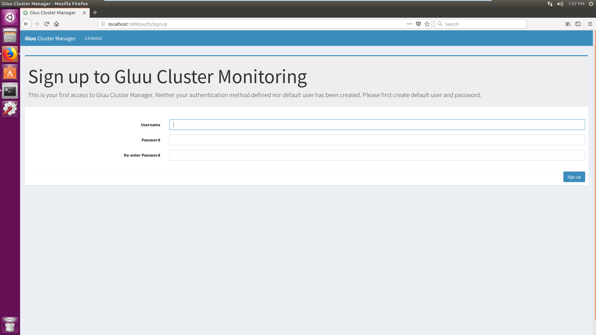
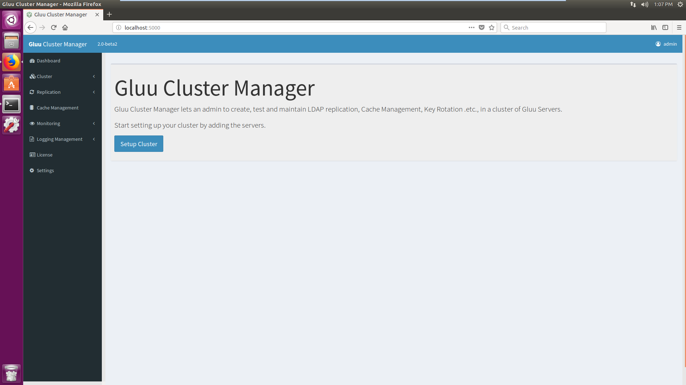
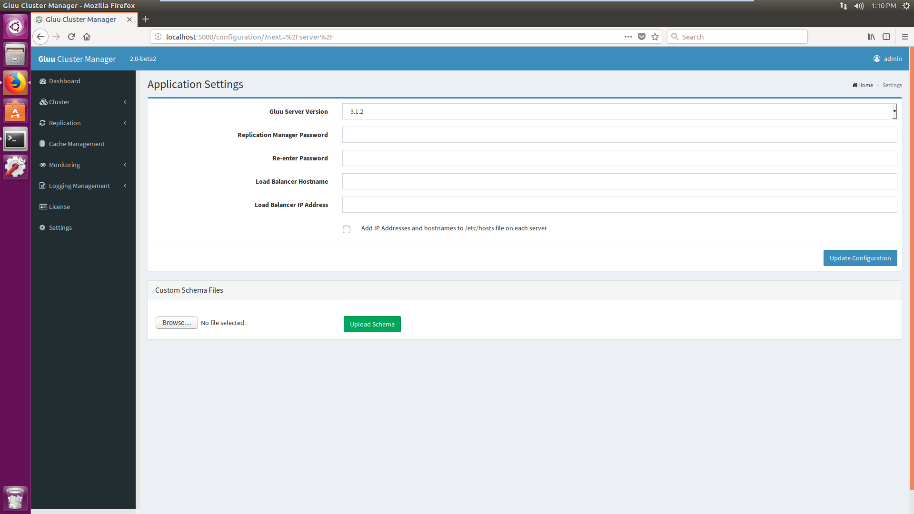
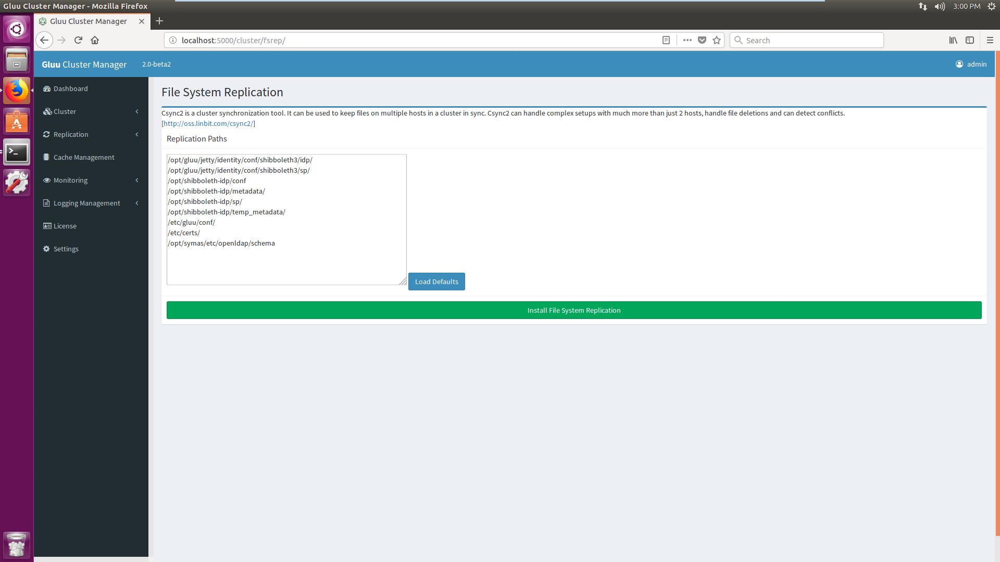
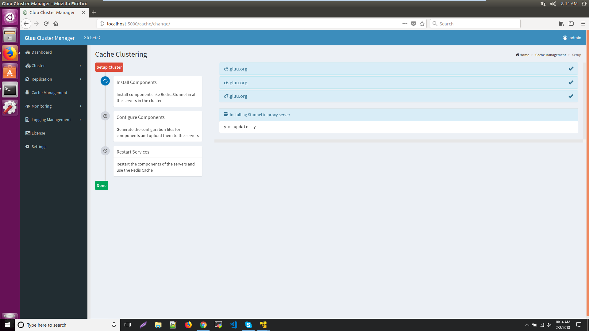
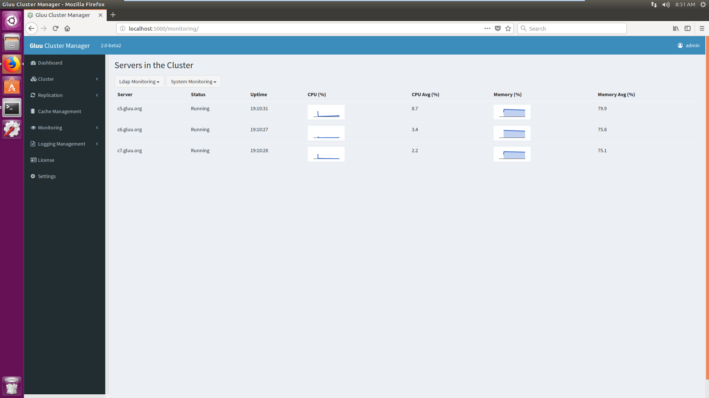

# Deploying a Gluu Cluster

Follow this doc to deploy a cluster of Gluu Servers using Cluster Manager!

## Getting Started

Upon initial launch of Cluster Manager, the following screen will be presented to create an admin username and password:

Afterwards, start the process of building a cluster by clicking the `Setup Cluster` button:

Provide values for the fields in the Applications Settings page: 

- Replication Manager Password will be used in OpenDJ for replication purposes

- Load Balancer will be the hostname of either the NGINX proxy server, or any other load balancing server in use for the cluster 

!!! Warning
    The load balancer hostname **cannot** be changed after Gluu has been deployed. To change the hostname, Gluu must be redeployed. 

- If any servers do not have Fully Qualified Domain Names (FQDNs), enable the `Add IP Addresses and hostnames to /etc/hosts file on each server` option. This will automatically assign hostnames to IP addresses in the `/etc/hosts` files inside and outside the Gluu chroot 

Once the settings are configured, click the `Update Configuration button`.

Click `Add Server`

The following screen is used to add the Primary Server, which will be used by other nodes to pull their Gluu configuration and certificates. After Deployment, all servers will function in a Master-Master configuration.

!!! Note
    Hostname will be the actual hostname of the server, not the hostname of the NGINX/Proxy server. If the `Add IP Addresses and Hostnames to/etc/hosts file on each server` option was enabled in the `Settings` menu, this will be the hostname embedded automatically in the `/etc/hosts` files on this machine.

Click `Submit` to get routed to the Dashboard.

The Dashboard lists all servers in the cluster and provides the ability to add more servers, edit hostnames and IP addresses, and install Gluu automatically.

Click the `Add Server` button to add another node. 

!!! Note
    The admin password set in the Primary server is the same for all the servers.

Once all servers have been added to the cluster, `Install Gluu` on the primary server.

- Values for the first five fields are used to create certificates
- Values for inumOrg and inumAppliance are generated automatically. Changing the defaults is not recommended
- Next, select which modules should be installed. The default Gluu components are pre-selected. For more information on each component, see the [Gluu docs](https://github.com/GluuFederation/docs-ce-prod/blob/3.1.2/3.1.2/source/index.md#free-open-source-software)
- Currently only OpenDJ is supported in Cluster Manager. This is pre-selected
- Accept the license agreements

Click `Submit` to begin installation. 

!!! Note 
    This may take some time, so please be patient.

Once completed, repeat the process for the other servers in the cluster.

When all the installations have completed, install NGINX:

- Navigate to `Cluster` in the left menu
- Select `Install Nginx`

Finally, the `LDAP Replication` screen will appear, where LDAP replication can be enabled and disabled.  

During initial deloyment click the `Deploy All` button and wait for the process to finish.

## Replication

Next navigate to the `Replication` tab to set up replication across the cluster. 

After configuring OpenDJ replication for the first time, this page will display replication status and other replication information.

Enable file system replication by clicking `Replication` on the left menu and selecting `File system Replication`. Click `Install File System Replication` to install and configure csync2 and replicate necessary configuration files.

!!! Note
    If necessary, replication paths for other file systems can be added here as well.

Navigate to `Cache Management` in the left menu to complete the cluster configuration. 

## Cache

oxAuth caches short-lived tokens, and in a balanced cluster all instances of oxAuth need access to the cache. To support this requirement and still enable high availability, Redis is installed outside the chroot on every Gluu server. Configuration settings inside LDAP are also changed to allow access to these instances of Redis.

The `Fetch Cache Method` button is used to determine whether or not your LDAP is properly configured to utilize Redis or if it's still using `IN_MEMORY` which will cause failures. It's not necessary to click, but good to have to make sure everything is configured properly.

Click `Setup Redis`

!!! Warning
    Redis does not utilize encrypted communication, so stunnel needs to be installed and configured on all servers to protect information with SSL.

!!! Note
    Twemproxy is also installed on the NGINX/Proxy server to achieve redundancy. Twemproxy can detect redis server communication failure to ensure high availability.

Cache configuration settings can be customized per the (component configuration)[https://gluu.org/docs/cm/#default-components] documentation and also inside oxTrust.

Once this task is complete, the Gluu Server cluster is fully functional. 

Navigate to the hostname of the proxy server provided in the `Settings` option.

## Monitoring   
Cluster Manager monitors the servers in the cluster to help better understand performance and potential issues. 

!!! Note
    Cluster Manager must be connected to the cluster in order to take advantage of monitoring features. 

Navigate to the `Monitoring` tab in the left-hand menu to see details about the servers in the cluster. 

## Logging   
Cluster Manager gathers logs from all the nodes in the cluster for troubleshooting. Logs can be sorted by log type (oxAuth, oxTrust, HTTPD[Apache2], OpenDJ and Redis), Host and also string search filters for easy sorting.

!!! Note
    Cluster Manager must be connected to the cluster in order to take advantage of logging features. 

Navigate to the `Logging` tab in the left-hand muni to view and sort logs related to servers in the cluster. 

