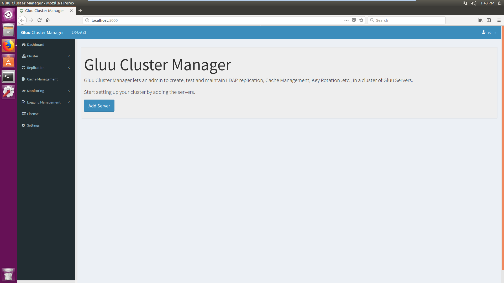
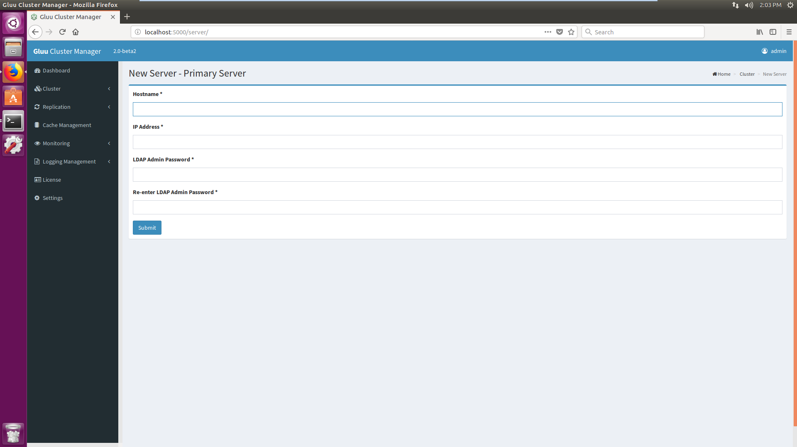
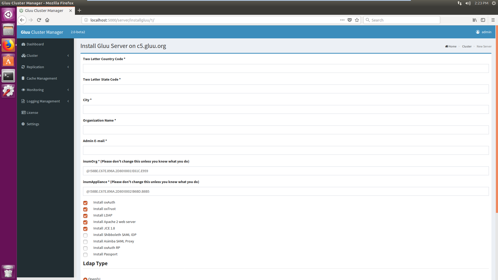
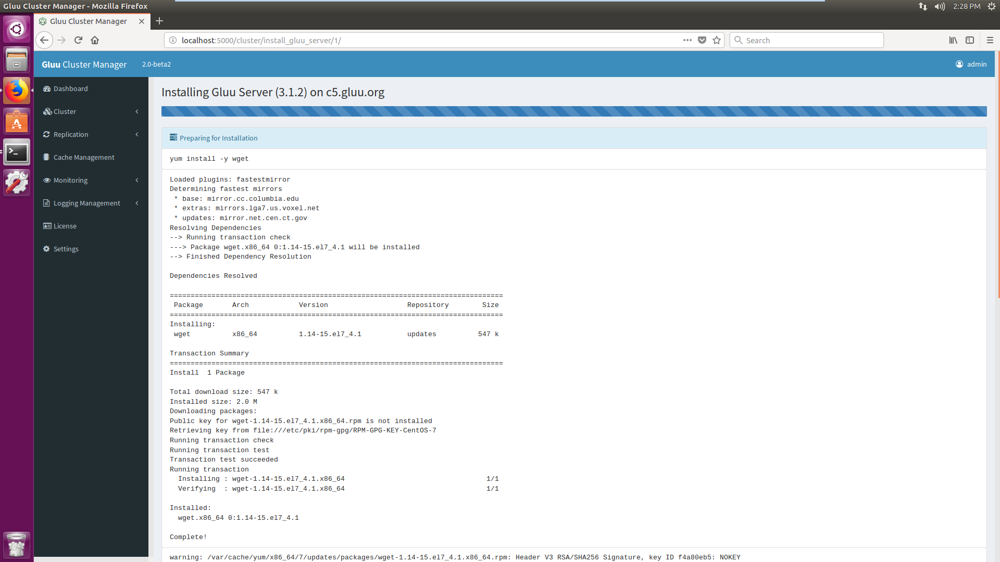
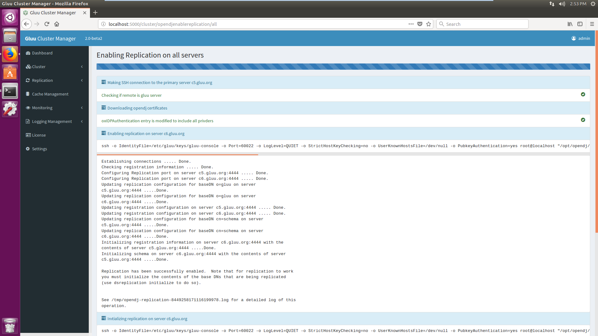
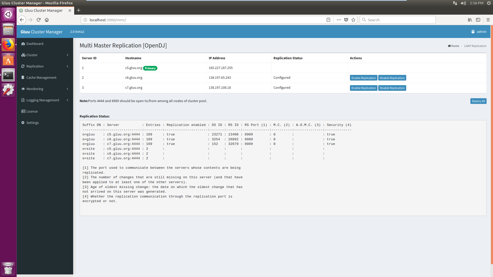
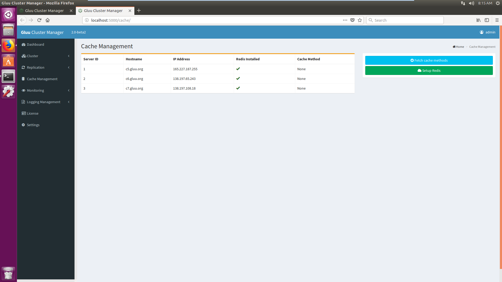
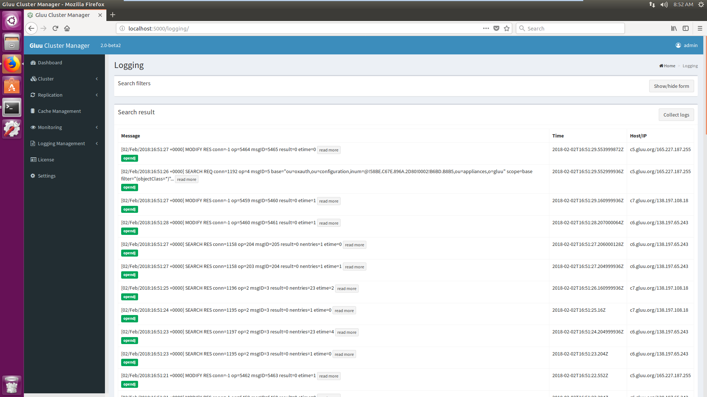

# Deploying a Gluu Cluster

To deploy a functioning cluster, it is necessary to do a few things.

## Getting Started

Here is the first screen you'll see on the initial launch where you create the default administrator and password:

Next you'll be taken to the splash page where you can initiate building a cluster with the `Setup Cluster` button:

Here is you `Settings` screen. You can access this screen again by clicking the `Settings` button on the left menu bar.

!!! Note
Replication Manager Password will be used in OpenDJ for replication purposes
- Load Balancer: This will be the hostname of either your NGINX proxy server, or the Load balancing server you'll be using for your cluster. Note, this cannot be changed after you deploy your Gluu servers, so please keep this in mind. To change the hostname, you'll have to redeploy Gluu Severs from scratch.
- `Add IP Addresses and hostnames to /etc/hosts file on each server`: Use this option if you're using servers without Fully Qualified Domain Names. This will automatically assign hostnames to ip addresses in the `/etc/hosts` files inside and outside the Gluu chroot. Otherwise, you may run into complications with server connectivity unless you manually configure these correctly.

Once these are properly configured, click the `Update Configuration button`.

Click `Add Server`

You will be taken to the `Add Primary Server` screen. It is called Primary as it will be the base for which the other nodes will pull their Gluu configuration and certificates. After Deployment, all servers will function in a Master-Master configuration.

!!! Note
Hostname will be the actual hostname of the server, not the hostname of the NGINX/Proxy server. If you selected the `Add IP Addresses and Hostnames to/etc/hosts file on each server` in the `Settings` menu, then this will be the hostname embedded automatically in the `/etc/hosts` files on this computer.

After you click `Submit`, you will be taken to the Dashboard.

!!! Note
Here you can see all the servers in your cluster, add more servers, edit the hostname and IP address of a server if you entered them incorrectly, and also Install Gluu automatically.

Click the `Add Server` button and add another node or 2. Note, the admin password set in the Primary server is the same for all the servers.

Once you've added all the servers you want in your cluster, back at the dashboard we will click `Install Gluu` on our primary server.

- This screen is the equivalent of the standard `setup.py` installation in Gluu. The first 5 options are for certificate creation.
- Next are inum configurations for Gluu and LDAP. Please don't touch these unless you know what you're doing.
- Following that are the modules you want to install. The default Gluu Server installation options comes pre-selected.
- Not seen are LDAP type, which is only one option at this time as OpenLDAP is not support, as well as license agreements.

Click `Submit`

!!! Note
Gluu will now be installed on the server. This may take some time, so please be patient.

Once completed, repeat the process for the other servers.

When all the installations have completed, you'll want to install NGINX. Do this by clicking `Cluster` on the left menu and selecting `Install Nginx`.

After that you'll be taken to the `LDAP Replication` screen where you can enable and disable LDAP replication. There is also a `Deploy All` button to be used for initial deployments. Click it and wait for the process to finish.

## Replication

!!! Note
You can also see the replication status and other replication information on this screen once you've deployed OpenDJ replication.

From here we need to enable file system replication. Do this by clicking `Replication` on the left menu and selecting `File system Replication`. Click `Install File System Replication` This installs and configures csync2 and replicates necessary configuration files if they're changed by oxTrust.

!!! Note
You can also add replication paths for other file systems, if you deem it necessary.

The last step for a functioning cluster configuration is the `Cache Management` option on the left menu. Click that and follow through the steps for deploying Cache Management.

## Cache

!!! Note
We have to configure oxAuth to utilize an external, network capable caching service because of the nature of clustering. oxAuth caches short-lived tokens and in a balanced cluster, all the instances of oxAuth need access to the cache. To allow this capability, and still enable high-availability, Redis is installed outside the chroot on every Gluu server. Configuration settings inside of LDAP are also changed to allow access to these instances of Redis.

!!! Warning
Redis doesn't utilize encrypted communication, so we will install and configure stunnel on all our servers to protect our information with SSL.

!!! Note
Twemproxy is also installed on the NGINX/Proxy server as a means for redundancy since Twemproxy can detect redis server communication failure, giving you high availability.

All of the cache configuration settings can be customized per the (component configuration)[https://gluu.org/docs/cm/#default-components] documentation and also inside of oxTrust.

Once this task is completed, you have a fully functional Gluu Server cluster. Please navigate to the hostname of the proxy server you provided in the `Settings` option.

## Additional Management Components

We've added a couple additional services to help deal with Gluu Server clusters. These are process monitoring and logging management. `Monitoring` and `Logging Management`, respectively, found on the left-hand menu.

Installation is a breeze, just click `Setup Monitoring` and `Setup Logging`

!!! Note
Monitoring gives you an easily accessible means to quickly take a glimpse at your servers performance and potential issues.

!!! Note
Logging is also another powerful tool to gather all of your Gluu logs from all the nodes for troubleshooting. These logs can be sorted by log type (oxAuth, oxTrust, HTTPD[Apache2], OpenDJ and Redis), Host and also string search filters for easy sorting.
